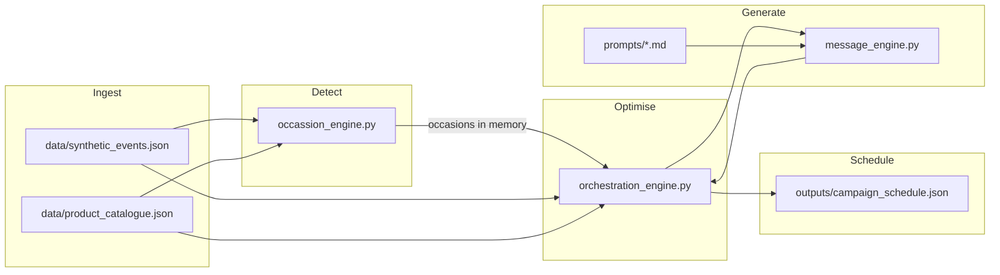

# AI Marketing Automation

Offline Python pipeline for occasion detection, LLM message generation, send-time optimisation, and campaign scheduling for a UAE luxury gifting brand.

## Architecture Overview

The system is a **single-process, file-based batch pipeline** (no database, no message broker). All engines are **stateless**: they read JSON inputs and return structured results; the only persisted state is written under `outputs/`.



| Stage | Module | Role |
|--------|--------|------|
| Ingest | `pipeline.py`, `utils.Data` | Load events and catalogue; optionally seed empty JSON via `data_generator.py` |
| Detect | `occassion_engine.py` | Infer future occasions per customer (Gregorian + Hijri) |
| Generate | `message_engine.py` | Channel-specific copy via LiteLLM + `prompts/` |
| Optimise & schedule | `orchestration_engine.py` | Channel choice, consent, fatigue cap, send time, parallel LLM calls |
| Entry | `main.py` | Logging bootstrap; runs `run_pipeline()` |

**Stateful vs stateless**

- **Stateless:** `occassion_engine`, `message_engine`, `orchestration_engine` (pure functions over inputs).
- **Stateful (run-scoped only):** `pipeline.run_pipeline()` writes `outputs/occasion_detection_results.json` and `outputs/campaign_schedule.json`. Scheduling uses in-memory occasion list from detection, not a reload from disk.
- **External state:** Committed data files, `.env` API key, Docker volume mount on `./outputs`.

## Setup & Running

**Prerequisites:** Docker and Docker Compose.

1. Create a `.env` file in the project root:

```env
OPENAI_API_KEY=sk-your-key-here
LLM_MODEL=gpt-4o-mini
```

| Variable | Required | Description |
|----------|----------|-------------|
| `OPENAI_API_KEY` | Yes* | OpenAI key for LiteLLM. If unset, message generation uses built-in fallback templates. |
| `LLM_MODEL` | No | Model id passed to LiteLLM (default: `gpt-4o-mini`). |

\*Pipeline still completes without a key; copy will not be LLM-personalised.

2. Start the full run (pipeline + tests):

```bash
docker-compose up --build
```

This builds the image (`Dockerfile`: Python 3.11-slim, `WORKDIR /app`, `COPY . .`, `PYTHONPATH=/app/src`), runs `python src/main.py`, then pytest with coverage. The `outputs/` directory is mounted to the host so artefacts appear locally.

**Outputs produced**

| File | Description |
|------|-------------|
| `outputs/occasion_detection_results.json` | Detected occasions with confidence and evidence |
| `outputs/campaign_schedule.json` | Scheduled sends (≥30 rows in a typical run) |
| `outputs/test-results.json` | Test pass/fail counts and coverage % |

**Project layout**

- `src/` — pipeline and engines (`pipeline.py`, `occassion_engine.py`, `message_engine.py`, `orchestration_engine.py`, `data_generator.py`, `models.py`, `utils.py`, `main.py`)
- `prompts/` — per-channel system prompts and `safety_rules.md`
- `data/` — synthetic events and product catalogue
- `tests/` — pytest suite and `tests/pytest.ini`
- `docker-compose.yml` — orchestrates build, pipeline, and tests

## Synthetic Data Design

Full methodology: [data/DATA_GENERATION.md](data/DATA_GENERATION.md).

**Shipped datasets (used by default)**

| Asset | Scale | Notes |
|-------|-------|-------|
| `data/synthetic_events.json` | **500 events**, **50 customers** (`cust_000`–`cust_049`) | ~14-month span; mix of orders, browses, WhatsApp interactions, profile updates |
| `data/product_catalogue.json` | **100 SKUs** | Six categories (flowers, cakes, chocolates, hampers, perfumes, combos); `cultural_flags` (halal, alcohol_free, vegan) and `occasion_tags` |

**Patterns and realism**

- **Seasonal gifting:** Repeat orders on similar month/day drive medium/low confidence occasion inference.
- **Cultural diversity:** Hijri Eid occasions projected per customer; catalogue flags support halal-safe messaging for Eid.
- **Multi-timezone behaviour:** Event timestamps use offsets mapped to zones (e.g. Asia/Dubai, Asia/Kolkata, America/Toronto) for send-time logic.
- **Recipients:** Orders and profile updates carry `recipient_name` / `recipient_relationship` for clustering (e.g. Mom → mother).

**Generator fallback:** `data_generator.py` only writes JSON if files are missing or empty (Faker-based 50×500 seed). Production runs use the committed files above.

## Occasion Detection Logic

Implemented in `src/occassion_engine.py`.

**Signals (in priority of confidence)**

1. **Profile updates (`high`)** — `birthday` / anniversary dates from `profile_update` events; predicted date rolled to next year if already past; evidence cites the saved field.
2. **Order history (`medium` / `low`)** — Grouped by `(customer_id, occasion_tag, recipient_name)`. Recurring orders in ≥2 distinct months → **medium**; single pattern → **low**. Predicted date = next Gregorian occurrence of the latest order’s month/day (day capped at 28).
3. **Hijri calendar (`medium`)** — For every customer, `eid_al_fitr` (Hijri 10/1) and `eid_al_adha` (12/10): `_next_hijri` walks forward day-by-day with `hijri_converter.Gregorian(...).to_hijri()` until the target Hijri month/day is found.
4. **Browse intent (`low`)** — ≥3 browses in a category maps to a fixed occasion (e.g. flowers → `mothers_day`); predicted date uses a fixed spring anchor (`_next_gregorian(3, 8)`).

**Recipient clustering**

- `recipient_relationships` counts relationship labels per `(customer_id, recipient_name)` from orders.
- Profile and order detections attach the majority relationship when known.

**Post-processing**

- Drop occasions with `predicted_date <= today`.
- Deduplicate on `(customer_id, occasion, recipient_name, predicted_date)`.

## Prompt Engineering

Prompt assets live in [`prompts/`](prompts/):

| File | Channel |
|------|---------|
| `email_prompt.md` | Email JSON: `subject`, `body` |
| `whatsapp_prompt.md` | WhatsApp template + variables |
| `push_prompt.md` | Push text + `app://` deep link |
| `safety_rules.md` | Brand and cultural rules (reference for validators) |

**Structure**

- Markdown system prompts with **runtime context** (customer, occasion, recipient, top products) injected as a JSON **user** message.
- **Few-shot examples** embedded in email/WhatsApp prompts (e.g. Mother’s Day, Eid).
- LiteLLM `response_format: json_object`; `utils.Data.parse_json_from_llm()` strips optional markdown fences before `json.loads`.

**Content safety (code-level, not LLM-only)**

- Regex ban list: discount/sale/cheap/last chance/buy now/% off (`message_engine.BANNED`).
- Eid: extra alcohol/pork checks; catalogue filtered to halal + alcohol-free products in context.
- Hallucinated product names: flag if ≥3 unknown title-case phrases vs catalogue.
- Channel hard limits: WhatsApp ≤1024 chars, ≤3 variables, opt-out footer; push ≤150 chars; email subject/body defaults if missing.
- On unsafe output: one retry with fallback templates; hard fail only if still unsafe.

**Resilience:** Missing API key, LLM errors, or missing prompt files trigger `_fallback_output()` but still return `success: True` so scheduling continues (logged as ERROR).

## Send-Time Optimisation

Implemented in `orchestration_engine._assignment_scheduling()` (per-customer context) and `_send_time()`.

**Timezone**

- Stable per customer from mode UTC offset → IANA zone (e.g. `Asia/Dubai`, `Asia/Kolkata`, `America/Toronto`).

**Hour selection**

- **Email:** mode hour from `browse` events.
- **WhatsApp:** mode hour from read `whatsapp_interaction` events.
- **Push:** mode hour from `order` events.
- **Cold start:** if fewer than 3 events, use **segment defaults** by region (e.g. UAE: WhatsApp 10:00, email 20:00 local).

**Urgency and channel rules**

- Days until `predicted_date` ≤ 2 → cap hour at 10 (earlier send).
- Email capped at 11:00; WhatsApp floored at 17:00.
- Quiet hours 23:00–05:59: bump hour forward until outside window.
- Schedule within `min(days_until_occasion, 7)` days ahead; convert final local time to UTC ISO timestamp on each `CampaignSend`.

## Fatigue & Consent Rules

**Fatigue (`_assignment_scheduling` + `build_campaign_schedule`)**

- **High beats low:** per customer and ISO week of `predicted_date`, only the highest-confidence occasion is eligible.
- **7-day cap:** outbound `whatsapp_interaction` in the last 7 days plus planned sends in the current run; max **2** promotional messages per customer before skip.
- `FatigueCheck.messages_this_week` reflects `promo_7d` + planned count; `within_limit` when total ≤ 2.

**Consent (`_consent`)**

- Email and push default **True** (`ConsentStatus` model).
- WhatsApp set **False** if any `whatsapp_interaction` has `opted_out: true`.
- Send aborted if chosen channel is not allowed on consent object.

**Channel preference (`_pick_channel`)**

- Uses browse count as **email engagement proxy** (`email_opens`) and WhatsApp read rate.
- WhatsApp preferred when read rate > 0.6 and no browse activity, or read rate ≥ 0.4.
- Else email; else push.

**Message step**

- Up to 12 parallel `generate_channel_message` calls; failures with `success: False` skip that send only.

## Test Strategy

Tests live in `tests/` (`test_engines.py`, `conftest.py`, `tests/pytest.ini`).

| Category | What is tested |
|----------|----------------|
| Occasion detection | Empty input fails; sample events yield high/medium/low, Hijri, future dates, evidence |
| Message engine | Unknown channel fails; WhatsApp/push limits; no banned discount language on email |
| Orchestration | ≤2 sends per customer; consent and fatigue flags on each send (LLM mocked) |
| Outputs / pipeline | `run_pipeline()` success; JSON artefacts exist and match schema (≥30 rows) |

**Mocking**

- Autouse fixture patches `utils.llm.complete` with deterministic JSON per channel (no network, no API cost).

**Coverage**

- `pytest-cov` with ≥80% threshold; `src/main.py` omitted from coverage.
- Summary written to **`outputs/test-results.json` only** (no `coverage.json` in repo workflow).
- Recent run: 7 tests, **~81%** coverage (`outputs/test-results.json`).

**Gaps**

- No live LLM integration tests; send-time and Hijri edge cases not exhaustively parametrized; `data_generator.py` generation paths lightly covered when committed data already exists.

## Known Limitations

- **Scale:** In-memory lists and a `ThreadPoolExecutor` for all planned sends; at **500 customers** with many occasions, runtime and LLM cost grow roughly with planned send count (not production-grade throughput).
- **Fatigue:** 7-day count uses event-stream proxies; no persistent ledger of past campaign runs.
- **Consent:** Only WhatsApp opt-out is inferred from events; email/push opt-out not modelled.
- **Channel stats:** Browse count proxies email opens; no real open/click telemetry.
- **Hijri:** Day-by-day scan (~400 days max); library deprecation warning (`hijri-converter`).
- **Scheduling:** Does not read `occasion_detection_results.json` back from disk; must re-detect in the same run.
- **Docker:** `prompts/` must be present in the image (`COPY . .`); if missing, logs show errors but fallback copy still fills the schedule.
## Intentional Design Trade-offs

Detailed notes: [DESIGN_DECISIONS.md](DESIGN_DECISIONS.md).

1. **File-based batch over services** — One-command `docker-compose up` and reproducible JSON outputs; trades away real-time ingestion, idempotent send ledger, and horizontal scale.
2. **Resilient messaging over strict LLM failure** — Exceptions and safety retries fall back to templates so the schedule always completes; trades away guaranteed LLM-quality copy when prompts or API fail.
3. **Parallel occasion scheduling over per-customer bundling** — Each detected occasion can become a send (subject to fatigue); trades away consolidated “one message per customer per week” campaigns and increases LLM call count.


